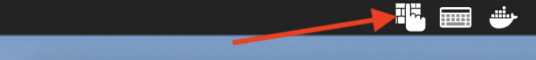
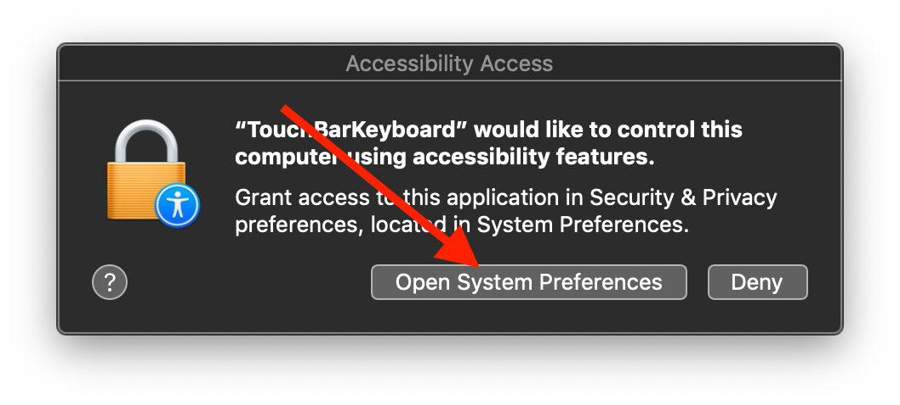
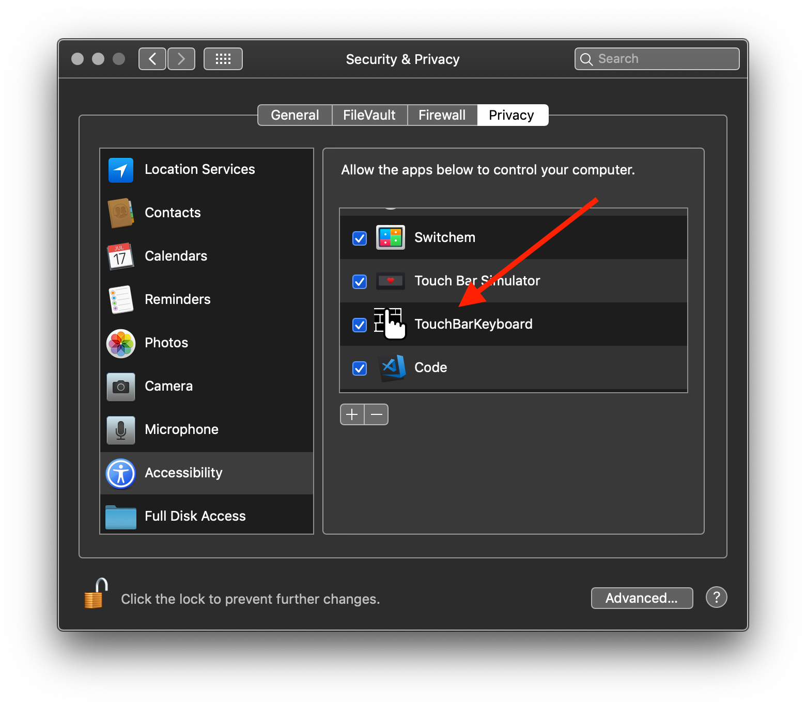

# Touch Bar Keyboard

Does your new MacBook Pro Keyboard keep breaking? Are you out of warranty? Can you not only use external keyboards? 

Add a fully functional keyboard to your touch bar! No thinness lost, it's the perfect solution!

A prebuilt release can be downloaded here.

Touch Bar Keyboard lives in your menu bar if for whatever reason you don't want need it anymore. Like if you bought a MacBook Pro 2015.

*Note:* Touch Bar Keyboard does require accessibility features to send keys. It will ask for these permissions when launched. Below is screenshots showing how to accept these permissions.

## Q & A

Q: How can I use this on my non-Touch Bar MacBook?  
A: [This link should help.](https://www.apple.com/shop/buy-mac/macbook-pro/13-inch-space-gray-256gb-2.3ghz-quad-core#)

Q: How come the key don’t repeat when you hold them down?  
A: How come your keys don’t work at ALL when you hold them down?

Q: Why did you do this?  
A: "I think the next best thing to solving a problem is finding some humor in it." - Frank A. Clark

Q: Can this be submitted to the App Store?  
A: Nope. It uses private API to put a Touch Bar Item in the System Tray Touch Bar Group.

## Author

[Ruben Nic](https://rubennic.com)  
[@RubensSandwich](https://twitter.com/RubensSandwich)

## Credit

mikicon - [Icon touch bar by mikicon from the Noun Project](https://thenounproject.com/search/?q=touch%20bar&i=741573)

Alexsander Akers - [Private API usage](https://github.com/a2/touch-baer)

## License

Touch Bar Keyboard is available under the MIT license. See the LICENSE file for more info.
